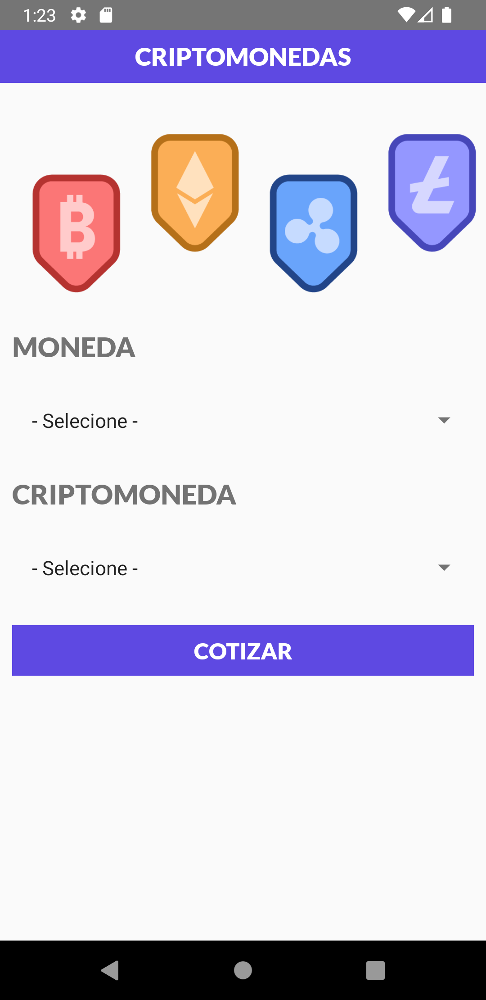
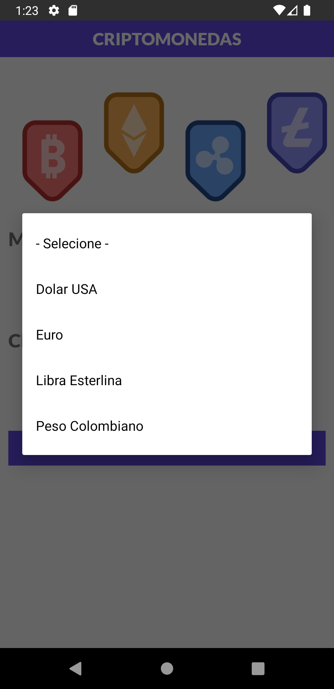
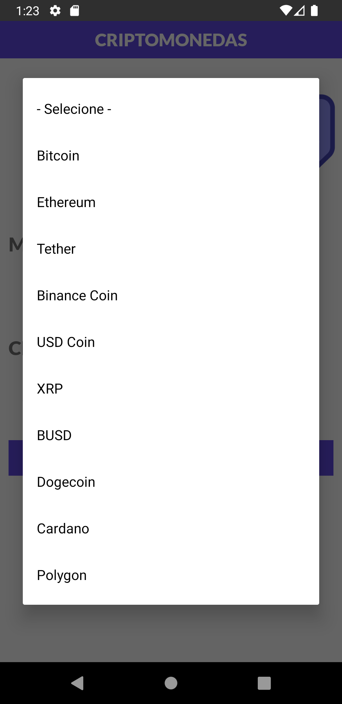
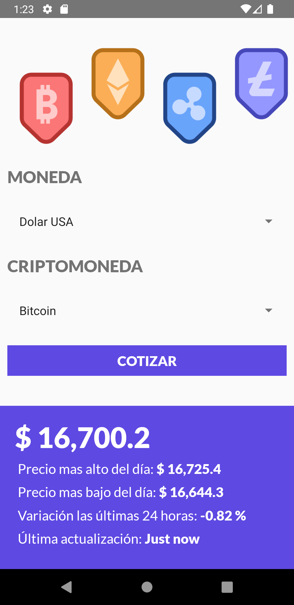
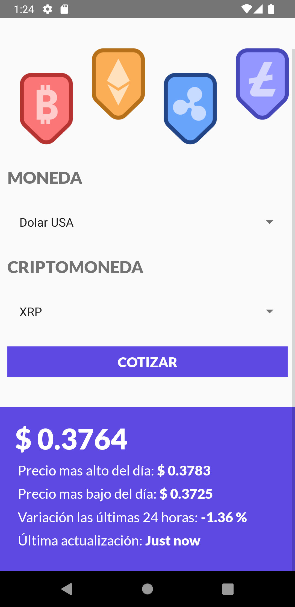
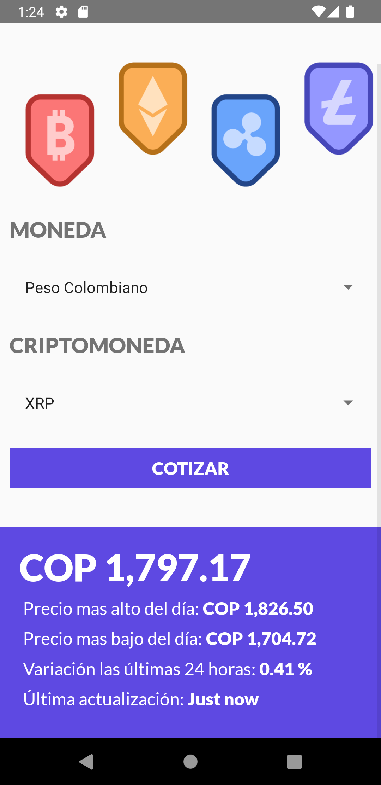

# Cripto currency App  
  App to consult the Crypto prices on different currencies using the API cryptocompare  
  
# Libraries

This project has the next libraryes:

1. react-native-picker/picker
2. axios

***Don't forget to install all the libraries to run the project***

# Images

 &nbsp;&nbsp;&nbsp;&nbsp;
 &nbsp;&nbsp;&nbsp;&nbsp; 
 &nbsp;&nbsp;&nbsp;&nbsp;  
 
 
 &nbsp;&nbsp;&nbsp;&nbsp;
 &nbsp;&nbsp;&nbsp;&nbsp;
 &nbsp;&nbsp;&nbsp;&nbsp;

 
 

